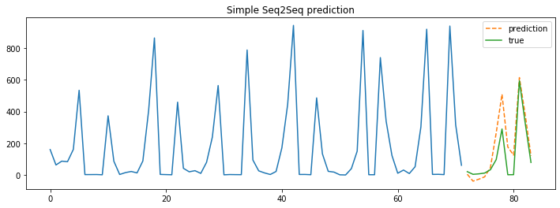
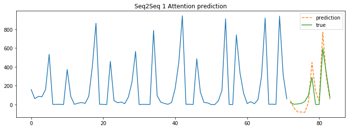
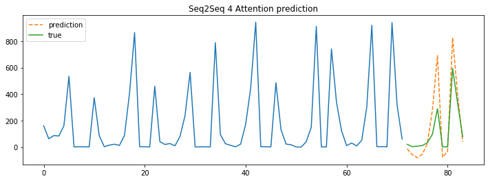
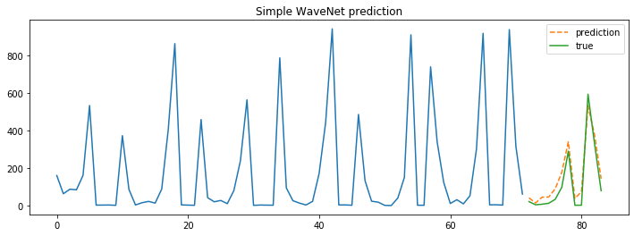

# Deep-Time-Series-Prediction
SOTA DeepLearning Models for Time Series Prediction and implemented by PyTorch. **Easy** For using and modified.

## Support Models

- [x] Simple Seq2Seq, without Attention, Condtion Variables;
- [x] Seq2Seq, Multi-Head-Attention, Condtion Model;
- [x] Simple WaveNet, without Condtion Variables;
- [ ] Condition WaveNet
- [ ] Wave2Wave with Condition

## Model Performance

|     model     | num of attention | RMSE(test) | loss(test) | loss(val) | loss(train) |
| :-----------: | :--------------: | :--------: | :--------: | :-------: | :---------: |
| SimpleSeq2Seq |        /         |   141.54   |   0.725    |   0.682   |    0.476    |
|    Seq2Seq    |        0         |   120.7    |   0.571    |   0.491   |    0.279    |
|    Seq2Seq    |        1         |   113.9    |   0.532    |   0.427   |    0.222    |
|    Seq2Seq    |        4         |   111.7    |   0.534    |   0.422   |    0.192    |
| SimpleWaveNet |        /         |    84.5    |   0.355    |   0.237   |    0.093    |

## Quick Start

**Detail Examples in [Model Performance Test Notebook.]([https://github.com/EvilPsyCHo/Deep-Time-Series-Prediction/blob/master/notebooks/Model%20Performance%20Test.ipynb](https://github.com/EvilPsyCHo/Deep-Time-Series-Prediction/blob/master/notebooks/Model Performance Test.ipynb))**

```python
from dtsp.dataset import Seq2SeqDataSet
from dtsp.models import Seq2Seq
from torch.utils.data import DataLoader, Subset

# build your dataloader
# trn_ld = DataLoader(Seq2SeqDataset(..), ..)

hp = {
        'path': Path('.').resolve() / 'logs',
        'target_size': 20,
        'rnn_type': 'LSTM',
        'dropout': 0.1,
        'hidden_size': 128,
        'teacher_forcing_rate': 0.5,
        'n_head': 1,
        'use_attn': True,
        'trans_hidden_size': 4,
        'trans_continuous_var': None,
        'trans_category_var': [(13, 2)],
        'trans_bidirectional': True,
        'trans_rnn_type': 'LSTM',
        'use_move_scale': True,
    }

compile_params = {
    'loss_fn': 'MSELoss',
    'optimizer': 'Adam',
    'lr': 0.001,
    'lr_scheduler': 'CosineAnnealingWarmRestarts',
    'lr_scheduler_kw': {'T_0': 5, 'T_mult': 10},
    'metric': 'RMSE',
}

model = Seq2Seq(hp)
model.compile(**compile_params)
model.fit(epochs, trn_ld, val_ld, early_stopping=10, save_every_n_epochs=None, save_best_model=True)

# model.predict(...)
# model = Seq2Seq.load(...)
# model.save(...)
```

## Prediction Visualization










## Seq2Seq Attention Visualization

4-head Seq2Seq Attention weights visualization.


## Usage

- python >= 3.6
- pytorch ==1.3

```shell
python setup.py install
```

## Tricks

- Walk Forward Split
- Windows Data Augments
- [SMAC3](https://automl.github.io/SMAC3/stable/) Hyperparameter Optimizer
- Hard encode the long lagged data
- [COCOB optimizer](https://arxiv.org/abs/1705.07795)
- Checkpoint & Seed Ensemble

## Refs

- [WaveNet Keras Toturial: TimeSeries_Seq2Seq](https://github.com/JEddy92/TimeSeries_Seq2Seq)
- [WaveNet Kaggle Web Traffic Forcasting Competition RANK 6](https://github.com/sjvasquez/web-traffic-forecasting)
- [Seq2Seq Kaggle Web Traffic Forcasting Competition RANK 1](https://www.kaggle.com/c/web-traffic-time-series-forecasting/discussion/43795#latest-631996)
- [Kaggle: Corporación Favorita Grocery Sales Forecasting Top1 LSTM/LGBM](https://www.kaggle.com/c/favorita-grocery-sales-forecasting/discussion/47582)
- [Kaggle: Corporación Favorita Grocery Sales Forecasting Top5 LGBM/CNN/Seq2Seq](https://www.kaggle.com/c/favorita-grocery-sales-forecasting/discussion/47556)
- [Temporal Pattern Attention for Multivariate Time Series Forecasting, 2018](https://arxiv.org/abs/1809.04206)
- BahdanauAttention: NEURAL MACHINE TRANSLATION BY JOINTLY LEARNING TO ALIGN AND TRANSLATE
- Effective Approaches to Attention-based Neural Machine Translation
- BahdanauAttention and LuongAttention
